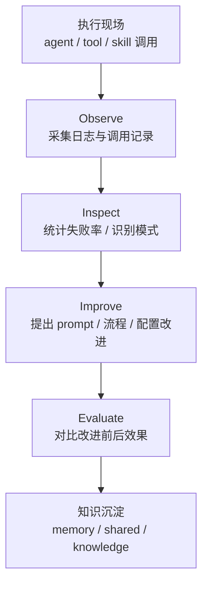

# Self-Improving 闭环怎么在一人 AI 公司里真正跑起来

> Status: draft  
> Version: GitHub professional edition  
> Scope: methodology + implementation notes

## 背景：为什么大多数 Self-Improving 最后都停在口号层

很多人都认可一个判断：Agent 不是一次性工具，而应该具备持续改进能力。

问题在于，真正落地时，Self-Improving 很容易停在两个极端：

- 一种是停留在概念层，知道应该“复盘、学习、优化”，但没有实际机制
- 另一种是直接追求自动进化，结果系统还没稳定，先把自己搞复杂了

在一人 AI 公司的语境里，这个问题更明显。因为没有独立运维团队，也没有额外的人手持续盯日志、做复盘、提改进。系统如果没有最小闭环，所谓自我改进只会停留在口头。

我们这次的做法不是直接追求全自动进化，而是先把 Self-Improving 拆成可以运行的最小闭环：

1. Observe：先记录发生了什么
2. Inspect：再判断哪里出了问题
3. Improve：针对高频失败点提出改进
4. Evaluate：验证改进有没有效果

其中一期和二期已经完成前两层半：`Observe`、`Inspect`、`Daily log 自动归档`、`高失败率告警` 已落地，`Improve` 和 `Evaluate` 进入待启动状态。

这套顺序背后的原则很简单：先让系统看得见自己，再谈系统优化自己。

---

## 问题：如果没有闭环，系统会怎样退化

在没有 Self-Improving 机制之前，多 Agent 系统通常会出现四类退化：

### 1. 失败会被快速遗忘

一次工具失败、一次路由错误、一次低质量产出，如果没有被结构化记录，过两天就会回到“凭印象讨论问题”的状态。

### 2. 成功经验无法沉淀成系统能力

某个流程偶尔跑通，不代表系统真的学会了。只有当执行记录、失败模式和改进措施被写入文件，经验才会从一次性事件变成资产。

### 3. 运营层没有事实基础

如果没有稳定日志和周期分析，系统管理只能靠主观感受：感觉最近还行，感觉某个 agent 不太稳，感觉某个 skill 很少用。这种“感觉管理”无法支撑长期优化。

### 4. 复杂系统会越来越依赖唯一操作者记忆

这也是一人公司最危险的地方。没有闭环时，系统运转依赖“我还记得上次哪里坏过”。一旦上下文切换、间隔拉长，很多关键经验就会丢失。

---

## 踩坑：我们没有直接做自动进化，而是先把问题拆小

在这轮实践里，Self-Improving 没有被定义成一个抽象能力，而被当成一个运营问题。

真实踩坑主要有三个：

### 踩坑 1：没有执行事实，就谈不上改进

最开始系统里已经有很多文件，但那不等于有自我改进能力。原因很直接：

- 文件记录的是结论，不是执行现场
- 结论能告诉你“发生过什么”，不能告诉你“失败模式是如何形成的”
- 如果没有稳定采集，后续就无法比较“改之前和改之后的差异”

所以第一步不是“写改进建议”，而是把执行事实抓出来。

### 踩坑 2：改进不能只靠聊天复盘

单次聊天里的复盘很容易失效，因为它没有固定输入，也没有稳定触发条件。下次再看时，很难比较，也很难累计。

因此我们没有把复盘寄托在人工临时总结上，而是把它做成定时运行的机制。

### 踩坑 3：过早追求自动优化，容易把系统复杂度拉高

在没有稳定 Observe / Inspect 之前，就直接上“自动修正 prompt”“自动改配置”“自动装 skill”，风险非常高。

因为这时系统缺少两个前提：

- 不知道哪些问题是真问题，哪些只是偶发波动
- 不知道改动之后到底有没有变好

所以我们刻意把闭环拆成四段，先落地采集和分析，再推进改进与验证。

---

## 方案：把 Self-Improving 变成一个可执行的运营闭环

### 一、Observe：先把执行记录沉下来

Observe 的职责不是分析，而是稳定记录事实。

当前落地方式：

```cron
# 每天 23:00 提取 session transcripts 中的 skill 调用记录
0 23 * * * /home/max/.openclaw/workspace-main/scripts/skill-observe.sh >> /home/max/.openclaw/workspace-main/logs/skill-observe.log 2>&1
```

这一步解决的是“系统到底做了什么”这个最基本的问题。

如果没有这一层，后面所有的失败分析都会退回到聊天印象和零散截图。

### 二、Inspect：按周期看失败率，而不是按情绪看系统

Inspect 的职责是把原始记录转成可判断的问题线索。

当前落地方式：

```cron
# 每周一 10:00 分析 tool 成功/失败率并告警
0 10 * * 1 /home/max/.openclaw/workspace-main/scripts/skill-inspect.sh >> /home/max/.openclaw/workspace-main/logs/skill-inspect.log 2>&1
```

Inspect 关注的不是单次报错，而是模式：

- 哪些工具失败率上升
- 哪些 skill 被频繁调用但产出不稳定
- 哪些链路需要告警而不是继续沉默运行

这一步把“凭感觉觉得有问题”改成“基于周期数据发现问题”。

### 三、Daily log：把运行事实变成长期可追溯资产

如果 Observe 和 Inspect 只输出临时日志，它们仍然很难进入长期记忆系统。

所以系统又加了一层 Daily log 自动归档：

```text
Observe 记录原始执行事实
→ Inspect 提炼异常与统计
→ Daily log 归档到 memory/日期.md
→ 后续回顾和文章写作可以直接复用
```

这一步很关键，因为它把“运营过程”接到了“长期记忆”上。系统不再只是能跑，还开始具备可复盘性。

### 四、高失败率告警：让问题尽早暴露，而不是靠人工偶遇

在最小闭环里，告警不是锦上添花，而是把被动发现问题变成主动暴露问题。

当前策略是：

- 周期运行 Inspect
- 一旦失败率高于阈值，自动通知用户
- 后续再决定是进入 Improve，还是先人工确认

这让系统从“出问题后才发现”转向“接近失控前先预警”。

---

## 结构：Self-Improving 闭环在系统里的位置

从架构上看，Self-Improving 并不是一个单独外挂模块，而是横跨多个层：



它至少同时依赖：

- 协作协议层：保证结果能回传、能入文件
- ITTO 执行层：保证改进动作有标准流程
- 知识层：保证日志和结论能够长期沉淀

这也是为什么 Self-Improving 不能被理解成“再装一个会学习的 skill”。它更像运营机制，而不是单点工具。

---

## 验证：这套最小闭环已经带来了什么结果

目前已经确认的结果有三类。

### 1. Observe / Inspect 已不是手工动作

它们已经变成 cron 驱动的固定节奏，而不是“有空再看一下”的可选动作。

### 2. 系统第一次拿到了连续运行数据

第一次运行结果显示：

- 过去 7 天，共有 `12` 个 skill 被激活
- 共记录 `336` 个事件
- 所有工具失败率整体很低
- `exec` 失败率约 `0.7%`
- 其他工具接近 `0%`

这类数据的价值不在于“数字本身多漂亮”，而在于系统第一次拥有了对自己运行质量的量化视图。

### 3. 改进动作开始具备明确入口

过去如果发现某个 skill 或流程有问题，通常只能靠临时讨论。现在至少已经能明确区分：

- 哪些问题来自工具层
- 哪些问题来自 prompt 层
- 哪些问题来自流程设计层
- 哪些问题值得进入下一步 Improve

这意味着后续的优化不会再是无差别修修补补，而是能根据失败模式定向推进。

---

## 经验：一人 AI 公司的 Self-Improving，重点不是“自动”，而是“闭环”

这轮实践最核心的经验有五条。

### 1. 没有 Observe，就没有 Self-Improving

先看到事实，再讨论优化。没有执行记录，任何自我改进都只是一种想象。

### 2. 没有周期 Inspect，系统就会退回情绪化管理

用周期数据看系统，比凭主观感受看系统可靠得多。

### 3. 改进动作必须接到文件系统和记忆系统上

不写入 `memory/`、`shared/`、`knowledge/` 的改进，长期看都很难真正留下来。

### 4. 自动化应该从采集和提醒开始，而不是从自动修正开始

最稳妥的路径是：

```text
先采集 → 再分析 → 再提醒 → 再人工确认改进 → 最后再考虑自动执行改进
```

这比一开始就追求“系统自己改自己”更适合真实运行环境。

### 5. Self-Improving 是运营层能力，不只是技术层能力

真正决定它能不能跑起来的，不只是脚本和日志工具，还有：

- 是否有固定节奏
- 是否有明确责任人
- 是否有统一回传和归档规则
- 是否能把改进前后结果放在一起比较

---

## 接下来：Improve 和 Evaluate 应该怎么补

当前闭环里，`Improve` 和 `Evaluate` 仍是待补阶段，但它们的方向已经比较清楚：

### Improve 应该做什么

- 对高失败率 skill 提出改进提案
- 区分问题来源：prompt、流程、配置、模型、工具链
- 把提案沉淀成可执行动作，而不是泛泛建议

### Evaluate 应该做什么

- 对比改进前后失败率
- 对比调用量与成功率变化
- 判断改进是否真的有效，而不是只做了改动

只有补上这两步，系统才算真正完成了从“能观察自己”到“能优化自己”的跨越。

---

## 结论

如果把 Self-Improving 理解成一个炫技概念，它很容易失控；如果把它理解成一套最小运营闭环，它就能一步一步落地。

这次实践给出的结论是：

> 一人 AI 公司的自我改进，不是先追求自动进化，而是先建立 Observe、Inspect、归档、告警四件基础设施。

先让系统持续看见自己，再让系统逐步优化自己。这条路径看起来更慢，但它更稳，也更适合真实可运行的一人公司架构。